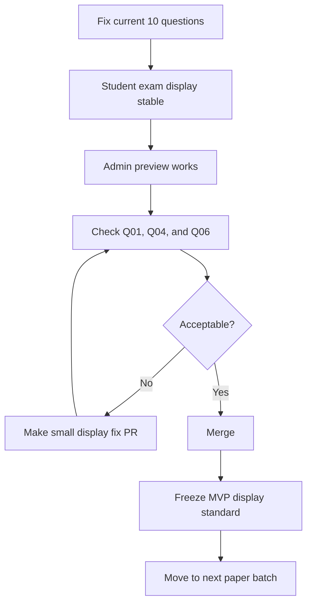
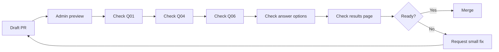

# Project Progress

## Current project goal

This project is a student-facing ESAT-style timed mock simulator. The current priority is making ENGAA 2016 P1 Q01-Q10 visually stable.

## Current phase

Phase 1: Display stabilisation.

## Project stages

## Progress board

| Area | Status | Notes | Next action |
| --- | --- | --- | --- |
| Q01-Q10 imported | Done | ENGAA 2016 P1 Q01-Q10 are in the question bank. | Keep scope fixed; do not import more questions yet. |
| Timed practice flow | Working | Core student timed-practice flow exists. | Check it after display stabilisation changes. |
| Formula display | In progress | KaTeX is the target renderer for clean exam-style maths. | Inspect Q01 and other formula-heavy questions. |
| Q04 image | In progress | Live display should use the stable SVG fallback. | Confirm the graph is complete and readable. |
| Q06 image | In progress | Live display should use the stable SVG fallback. | Confirm all diagrams are visible, not just a top strip. |
| Admin preview | In progress | Preview page should make visual QA practical. | Use it to inspect all 10 questions before merge. |
| PDF crop automation | Paused | Experimental helper only; not trusted for live display without review. | Do not expand unless it directly affects current display work. |
| New question import | Not started | Out of scope for display stabilisation. | Wait until Q01-Q10 display is stable. |
| AI-generated questions | Not started | Out of scope for the current MVP display phase. | Revisit after imported-paper workflow is reliable. |

## PR check workflow

## Clear next action

Finish the display stabilisation PR, inspect admin preview, then merge only if Q01, Q04 and Q06 look acceptable.
